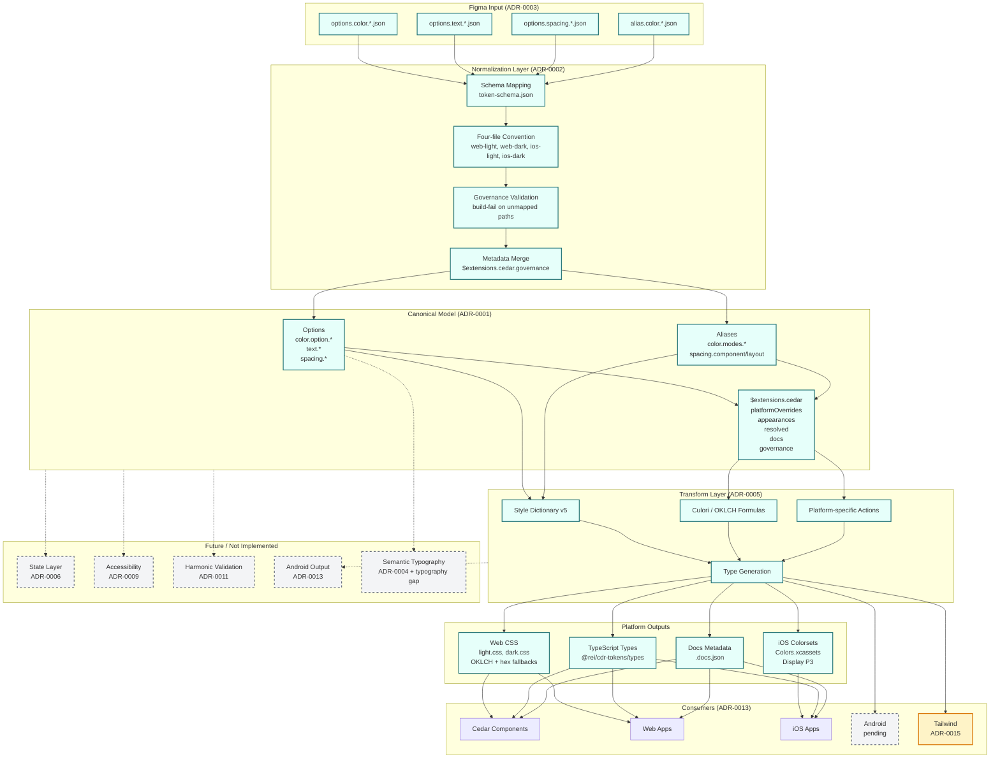

# Cedar Token Pipeline — Current Architecture

## Layer Descriptions

| Layer | ADR | Status | Description |
|---|---|---|---|
| **Figma Input** | ADR-0003 | Implemented | Four-file platform convention, schema-backed path mapping in `token-schema.json` |
| **Normalization** | ADR-0002 | Implemented | Transforms raw Figma files into canonical model with governance validation |
| **Canonical Model** | ADR-0001 | Draft | Platform-agnostic token shape with `$extensions.cedar` for platform data, resolved values, docs, and governance metadata |
| **Transform Layer** | ADR-0005 | Planned | Style Dictionary v5 pipeline with platform-specific transforms, OKLCH formulas, and type generation |
| **Platform Outputs** | — | Implemented | Web CSS (light/dark with OKLCH), iOS colorsets (Display P3), TypeScript types, docs metadata |
| **Consumers** | ADR-0013 | Proposed | Cedar components, web apps, iOS apps, Android (pending), Tailwind (ADR-0015) |

## Key Architectural Decisions

- **ADR-0012 (Hybrid Alias Resolution)** — Alias `$value` references remain as canonical source of truth; pre-resolved values in `$extensions.cedar.resolved` give transforms deterministic values without dictionary traversal
- **ADR-0010 (Token Documentation Architecture)** — Split authority: Figma owns descriptions in `$extensions.cedar.docs`, repo owns governance metadata in `$extensions.cedar.governance`
- **ADR-0007 (Modes and Palettes)** — Light/dark modes and default/sale palettes implemented via `$extensions.cedar.appearances` on option tokens
- **ADR-0008 (Responsive and Adaptive Tokens)** — Fluid spacing with `clamp()` implemented; container query tokens and density tokens proposed
- **ADR-0014 (Composite Style Values)** — Token repo contains atomic single-value tokens only; composite styles live in platform libraries (cedar-styles, iOS library, Android library, Tailwind preset)
