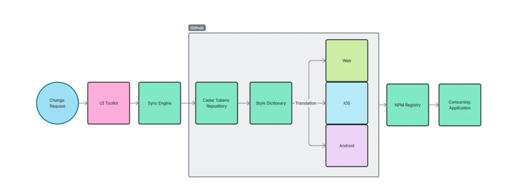

# V0 Architecture — Cedar Token Pipeline Spike

This document describes the **V0 architecture** for Cedar’s token pipeline spike.  
V0 is intentionally **one‑directional (Figma → Canonical → Style Dictionary)** and is designed to validate feasibility, reduce manual effort, and establish a stable foundation for future automation.

Although V0 is limited in scope, the architecture includes **explicit future ports** that enable bidirectional sync and automated governance in V1+ without re‑architecture.

---

# Architectural Goals

- Support PM’s requirement that **design originates token changes**
- Validate a **manual, one‑directional pipeline** from Figma → Canonical → SD
- Establish a **normalized token contract** as the canonical interface
- Demonstrate **diffing**, **impact detection**, and **manual governance**
- Produce **SD‑ready outputs** (CSS + optional Figma‑shaped JSON)
- Ensure the architecture is **future‑proof** for reverse‑sync and automation

---

# Architecture Diagrams

### Production Pipeline Overview

### Notes
- **Port A (future sync‑back):** SD → Figma using a Figma‑shaped JSON payload  
- **Port B (future proposal intake):** External design‑side proposal sources → Normalized Contract  
- V0 implements only the **downward flow**, but the architecture is shaped to support both ports later.

---

# Layer‑by‑Layer Breakdown

## 1. Figma (Proposal Environment)
- Designers originate token changes.
- Figma Variables API provides raw JSON.
- Figma is **not** the canonical source of truth — only the **originating environment**.

**Output:** `raw-figma-variables.json`

---

## 2. Ingestion Layer
- Raw Figma JSON is exported manually.
- No transformation occurs here.

**Output:** `raw-figma-variables.json`

---

## 3. Normalization Layer
Transforms raw Figma variables into the **V0 canonical shape**.

In V0, normalization:
- Converts Figma variable IDs → canonical token paths  
- Applies DTCG structure (`$type`, `$value`)  
- Preserves metadata in `$extensions.cedar`  
- Processes **color tokens only**  
- Ignores local styles, composite tokens, multi‑mode, multi‑collection  

**Output:** `canonical.json` (pre‑validation)

---

## 4. Diff Layer
Compares two canonical snapshots.

Detects:
- added tokens  
- modified tokens  
- removed tokens  

**Output:** `diff.json`

---

## 5. Impact Detection
Maps variable changes to affected components.

In V0, this is lightweight and mock‑based.

**Output:** `impact.json`

---

## 6. Governance Layer
Applies **V0 canonical shape validation** (derived from ADR‑0001).

In V0:
- Only color tokens are allowed  
- Only canonical shape is validated  
- No naming grammar or semantic grammar enforcement  

**Output:** `governance.md` (manual notes)

---

## 7. Style Dictionary (Transform Layer)
Consumes the **validated canonical model** and produces platform‑specific outputs.

In V0:
- CSS variables  
- JS/TS token exports  
- Optional Figma‑shaped JSON for future sync‑back  
- No publishing or versioning  

**Output:** `dist/`

---

## 8. Output Layer
V0 produces:

- **CSS variables** for consumers  
- **JS/TS token exports**  
- **Figma‑shaped JSON** (future sync‑back placeholder)

**Artifacts:**
- `sd-output-css.txt`
- `sd-output-figma.json`
- `dist/`

---

# Future‑Ready Ports

## Port A — Sync Back to Figma
- Uses SD’s Figma‑shaped JSON output.
- Enables SD → Figma updates.
- Prevents drift between design and code.
- Not implemented in V0.

## Port B — Design Proposal Intake
- Allows proposals from:
  - Figma plugins  
  - design tools  
  - external proposal systems  
- Normalizes proposals into the token contract.
- Not implemented in V0.

---

# Why This Architecture Is Future‑Proof

- The **normalized token contract** is the backbone of both directions.
- Governance sits **between** proposal and canonical truth.
- SD outputs include a **Figma‑shaped JSON** payload for future sync‑back.
- Diffing and impact detection are **direction‑agnostic**.
- No layer needs to be rewritten when bidirectional sync is added.
- V0 constraints (color‑only, single‑mode) do not affect V1 extensibility.

---

# Related Files

- `/README.md` — Architecture index  
- `/spike/v0-spike-plan.md` — Full V0 scope and implementation plan  
- `/artifacts/` — JSON artifacts for each layer  
- `/notes/` — governance, risks, learnings  

---
