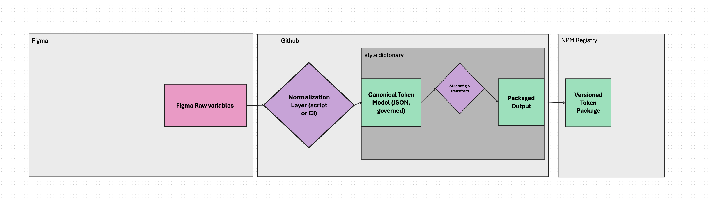

# Data Architecture — Cedar Token Pipeline (V0)

This document defines the **data‑layer architecture for the V0 spike** of Cedar’s token pipeline.  
It describes the data shapes, environment boundaries, and transformation layers that govern how tokens move from **Figma → Normalization → Canonical Model → Style Dictionary → NPM**.

The purpose of this diagram is to provide a stable reference for:

- **ADR‑0001** (Canonical Token Model)  
- **ADR‑0002** (Normalization Layer)  
- **ADR‑0003** (Figma Input Contract)  

All V0 behavior is intentionally minimal and does not represent the full V1 architecture.

---

## Overview

The V0 data architecture is structured around three core principles:

- **Raw → Normalized → Canonical → Transformed**  
- **The Canonical Token Model is the source of truth**  
- **V0 supports color tokens only**

This diagram complements the V0 architecture by focusing specifically on **data flow**, not process flow.

---

## Data Architecture Diagram

---

# Layer Definitions

## 1. Raw Figma Variables (Figma Environment)

The ungoverned, design‑shaped JSON exported from the Figma Variables API.

Characteristics:

- Contains raw design metadata  
- Includes variable IDs, names, resolved types, and per‑mode values  
- Not suitable for direct consumption  
- Input to the V0 Normalization Layer  

**Artifact:** `raw-figma-variables.json`

---

## 2. Normalization Layer (GitHub Environment)

Transforms Raw Figma Variables into the **V0 Canonical Model**.

In V0, normalization:

- Converts Figma variable IDs → canonical token paths  
- Applies **DTCG structure** (`$type`, `$value`)  
- Preserves metadata in `$extensions.cedar`  
- Processes **color tokens only**  
- Ignores:
  - local styles  
  - composite tokens  
  - multi‑mode values  
  - multi‑collection structures  
- Does **not** enforce naming grammar or semantic rules  

**Artifact:** `canonical.json` (pre‑validation)

---

## 3. Canonical Token Model (GitHub Environment)

The **single source of truth** for all downstream transforms.

In V0, the canonical model:

- Supports **color tokens only**  
- Preserves alias references  
- Stores metadata under `$extensions.cedar`  
- Is validated against the **V0 canonical schema**  
- Is consumed by Style Dictionary  

**Artifact:** `canonical.json` (validated)

---

## 4. SD Config & Transform (Style Dictionary Environment)

Consumes the V0 Canonical Model and produces platform‑specific outputs.

V0 supports:

- CSS variables  
- JS/TS token exports  
- (Optional) Figma‑shaped JSON for future sync‑back  

**Artifacts:**

- `css/`  
- `tokens.json`  
- `figma.json` (optional)

---

## 5. Packaged Output (GitHub / CI Environment)

Bundles all Style Dictionary outputs into a distributable package.

- Includes all platform outputs  
- Prepared for publishing  

**Artifact:** `dist/`

---

## 6. NPM Registry (Distribution Environment)

Receives the versioned token package.

- Consumers install via NPM  
- This is the distribution layer, not the source of truth  

**Artifact:** `@rei/tokens`

---

# Environment Boundaries

The architecture explicitly separates:

- **Figma** — proposal environment  
- **GitHub** — normalization + canonical truth  
- **Style Dictionary** — transform engine  
- **NPM** — distribution  

This ensures clarity in ownership, debugging, and future automation.

---

# Relationship to ADRs

- **ADR‑0001** defines the Canonical Token Model  
- **ADR‑0002** defines the Normalization Layer  
- **ADR‑0003** defines the Figma Input Contract  
- **ADR‑0005** defines the Transform Layer  

This document provides the shared data foundation for all of them.
